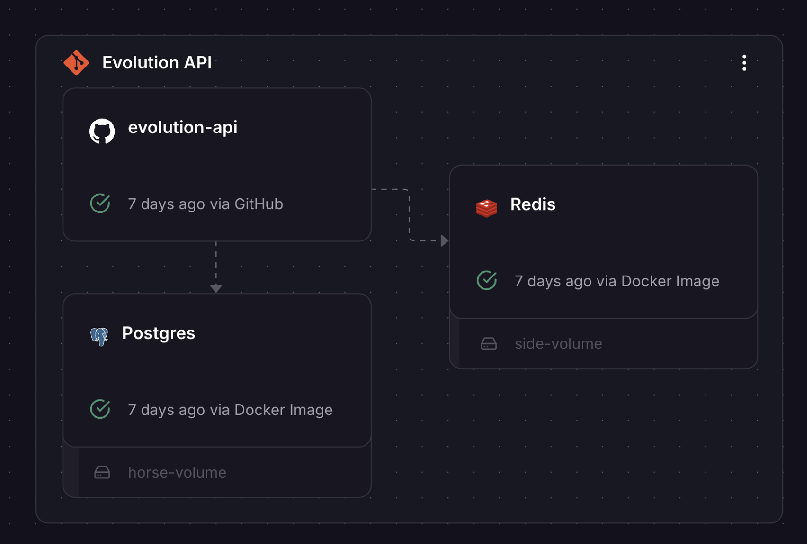

# Evolution API

## Instalación en Docker

Esta es una guía práctica y objetiva para configurar Evolution API con PostgreSQL y Redis utilizando Docker y Docker Compose.

---

### Requisitos previos

Asegúrate de tener:

1. **Docker y Docker Compose** instalados ([Guía de instalación](https://docs.docker.com/get-docker/)).
2. **Clave de autenticación** para la API (_API Key_).

---

### Paso 1: Estructura del Proyecto

Asegúrate de que los siguientes archivos estén en el directorio del proyecto:

1. `Dockerfile`
2. `docker-compose.yml`

---

Crea un archivo `Dockerfile` en el directorio raíz con el siguiente contenido:

```dockerfile
# Usando la imagen oficial de Evolution API
FROM atendai/evolution-api:v2.1.1

# Variables de entorno
ENV AUTHENTICATION_API_KEY=change_me

# Exponer el puerto de la aplicación
EXPOSE 8080

# Comando para iniciar la API
CMD ["npm", "run", "start:prod"]
```

---

### Paso 2: Configurar Variables de Entorno

Crea un archivo `.env` copiando el `.env.example` que ya hay en el repositorio y agrega la siguiente configuración:

```env
# Sustituye con tu clave de autenticación
AUTHENTICATION_API_KEY=tu_clave_de_autenticación
```

Para generar un Hash (Clave de acceso), accede al siguiente sitio y copia la clave de cifrado de 256 bits generada en el campo:

[Generador de Claves](https://acte.ltd/utils/randomkeygen)

---

### Paso 3: Iniciar el Entorno con Docker Compose

Ejecuta el siguiente comando para levantar los contenedores (este comando usara el archivo `docker-compose.yml` que ya esta en el repositorio):

```bash
docker-compose up -d
```

Este comando hará lo siguiente:

1. Crear e inicializar PostgreSQL.
2. Configurar Evolution API para usar PostgreSQL y Redis.
3. Exponer la API en el puerto `8080`.

---

### Paso 4: Verificar la Instalación

Una vez levantado el servicio, puedes acceder a la API en:

```
http://localhost:8080
```

Para verificar si PostgreSQL está funcionando correctamente, utiliza un cliente de base de datos (como DBeaver o pgAdmin) y conéctate con las siguientes credenciales:

- **Host:** `localhost`
- **Puerto:** `5432`
- **Usuario:** `evolution_user`
- **Contraseña:** `evolution_password`
- **Base de Datos:** `evolution_db`

---

### Paso 5: Documentación Adicional

Para más información sobre la API, consulta la [documentación oficial](https://doc.evolution-api.com/v2/pt/get-started/introduction).

---

## Instalación en Railway

Este repositorio está configurado para que Railway monte el servicio de Evolution API pero por desgracia hay que desplegar también los otros dos contenedores de PostgreSQL y Redis.



### Pasos a seguir

1. Crea los servicios necesarios (Evolution API, PostgreSQL y Redis) con el boton de arriba a la derecha `Create`

- Para el de Evolution API selecciona GitHub Repo y pega el enlace de este repositorio

```sh
  https://github.com/Racks-Labs/evolution-api
```

- Para Postgres y Redis en la opcion `Database` selecciona ambas disponibles.

2. Configura las variables de entorno de Evolution API para que se conecte a ambas bases de datos. El funcionamiento es similar

**Link al repositorio original** - [Evolution API](https://github.com/NathanConde-dev/evolution-api)
